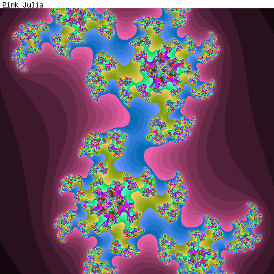

# Mafi

Mafi is a MAth Friendly Interpreter. The orignal purpose of writing this program was to learn how to write a parser manually without the help of a lexical analyzer (e.g., lex) and a parser generator (e.g., yacc). I started writing this code in 1996 on UN*X and ported it to CellVic, a PDA developed by a Korean company, in 2001. Mafi supports graphic calculation using the GD image library.



* Homepage in Korean: https://oldgeni.isnew.info/cellvic.html#_mafi
* Manual in Korean: https://oldgeni.isnew.info/cellvic/mafi/index.html
* Examples in CellVic: https://oldgeni.isnew.info/cellvic/mafi/index.html#Examples

The following example calculates pi up to 103 decimal places:
```
n=26; // decimal places = 4*(n-1)+3; n=26 will print 103 decimal places
if(n<1)
  n=1;
else
  n=round(n);
a=10000;
b=0;
c=14*n;
d=0;
e=0;
f=M[](c,1,a/5);
g=0;

_v_width=-4;
_v_prec=3;

d=0;
g=2*c;
for(b=c;;d*=b){
  d+=f[b,1]*a;
  f[b,1]=d%--g;
  d=fix(d/g--);
  --b;
  if(!b)
    break;
}
c-=14;
(e+fix(d/a))*1e-3,"";
e=d%a;

_v_prec=0;
for(;;){
  d=0;
  g=2*c;
  if(!g)
    break;
  for(b=c;;d*=b){
    d+=f[b,1]*a;
    f[b,1]=d%--g;
    d=fix(d/g--);
    --b;
    if(!b)
      break;
  }
  c-=14;
  e+fix(d/a),"";
  e=d%a;
}
```

Output:
```
3.1415926535897932384626433832795028841971693993751058209749445923078164062862089986280348253421170679821
```

## License

Copyright (C) 1996, 2001, Huidae Cho <<https://idea.isnew.info>>

This program is free software: you can redistribute it and/or modify it under the terms of the GNU General Public License as published by the Free Software Foundation, either version 3 of the License, or (at your option) any later version.

This program is distributed in the hope that it will be useful, but WITHOUT ANY WARRANTY; without even the implied warranty of MERCHANTABILITY or FITNESS FOR A PARTICULAR PURPOSE. See the GNU General Public License for more details.

You should have received a copy of the GNU General Public License along with this program. If not, see <http://www.gnu.org/licenses/>.
